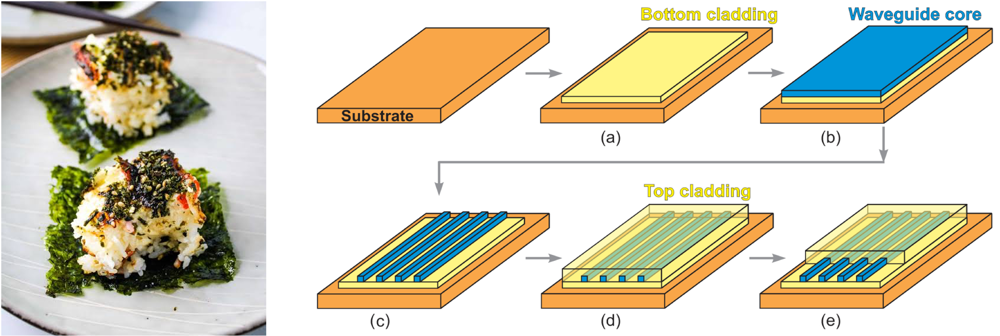
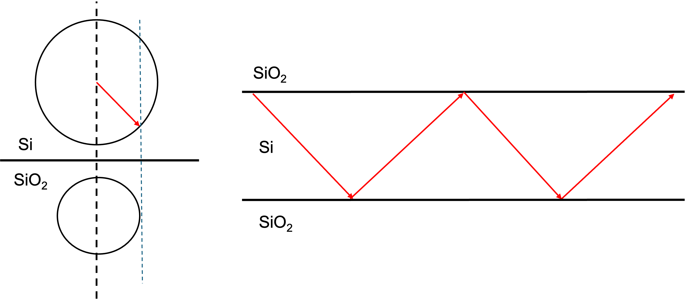
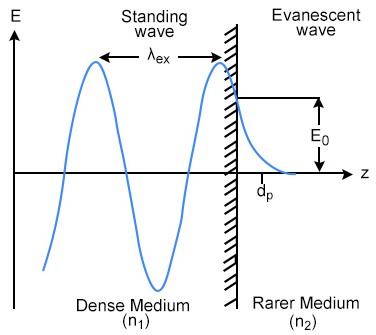
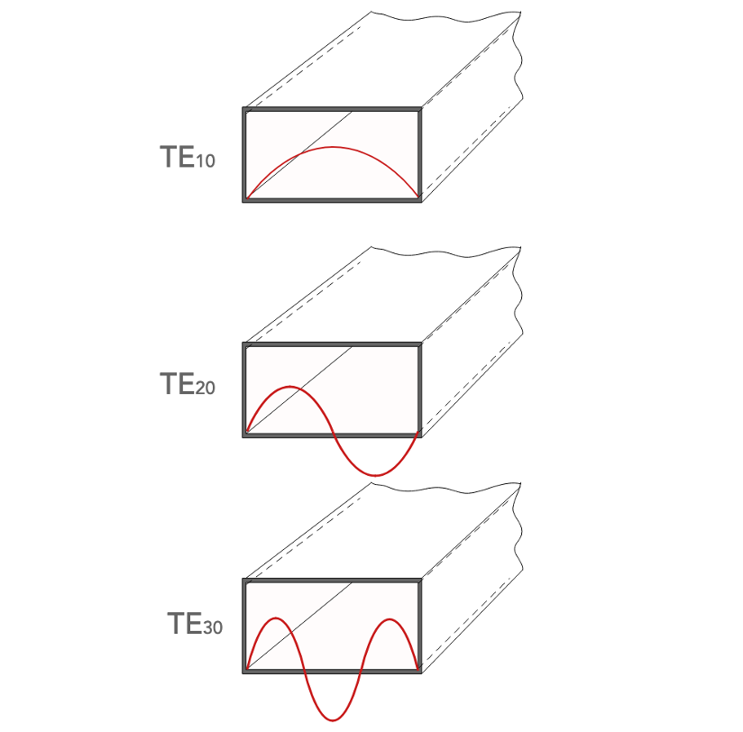
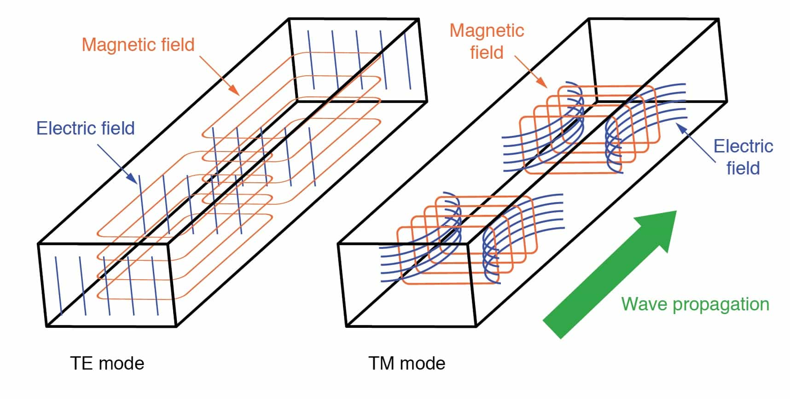
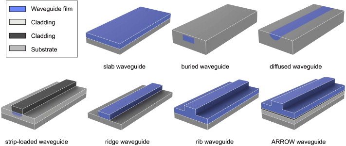
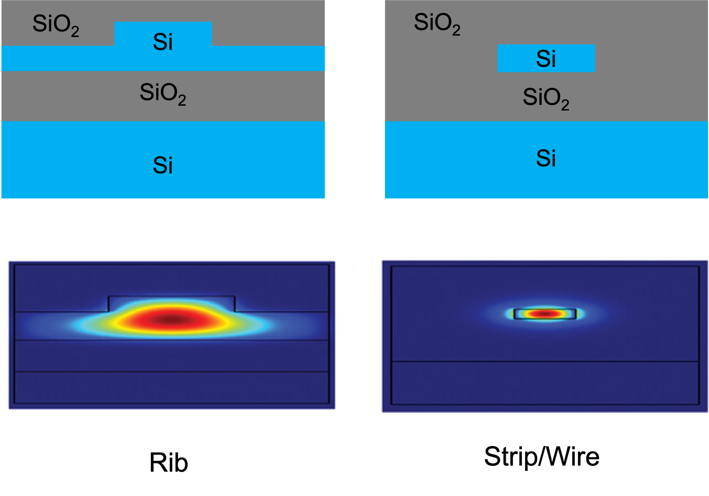
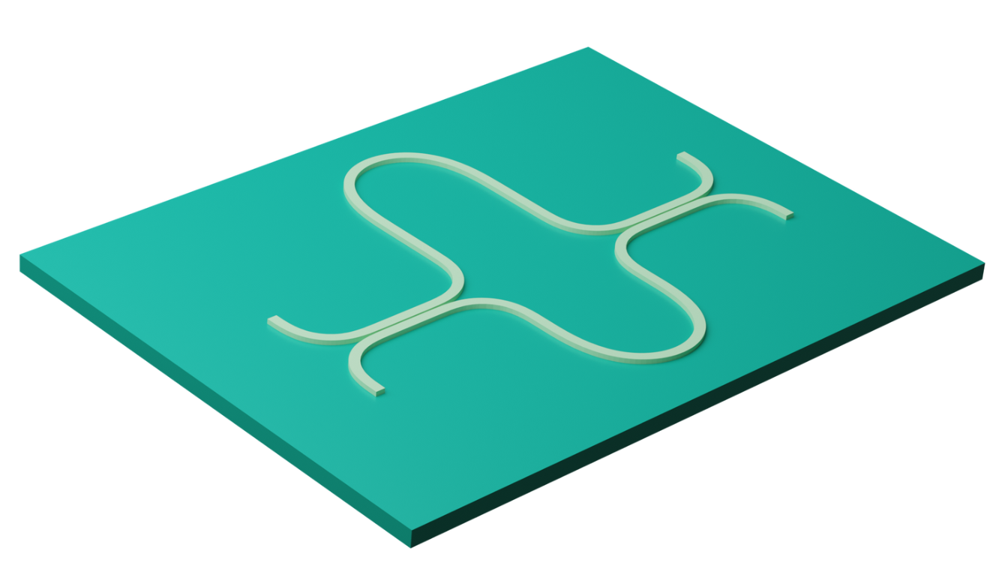
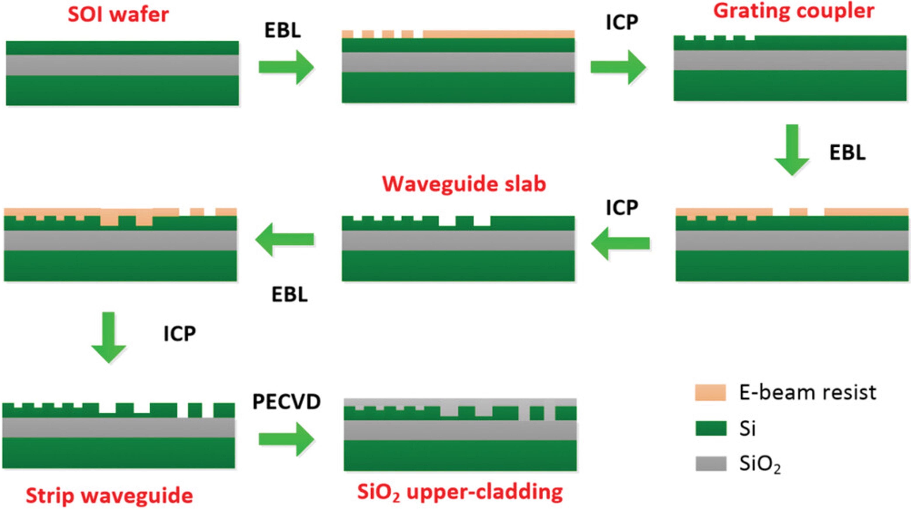

+++
title = "Silicon Photonic Waveguides for ASIC Engineers: From Total Internal Reflections to Foundry Process"
date = 2026-08-15
description = "I wanted to write this post both as a record of what I’ve learned and as a quick intro for other ASIC engineers who want enough photonics background to understand what is happening around the electronics."

[extra]
featured = true
+++

Recently, I’ve been reading through a bunch of silicon photonics papers because I’m spending the summer as an ASIC engineer at Ayar Labs.

Ayar Labs works on co-packaged optics (CPO), where electronic and photonic components are brought together inside the same package. My background is in traditional silicon-based electronic integrated circuits (EICs), but my daily work now constantly brings me across terms like **waveguide**, one of the most basic building blocks of a silicon photonic chip.

So I wanted to write this post both as a record of what I’ve learned and as a quick intro for other ASIC engineers who want enough photonics background to understand what is happening around the electronics.

## What is a silicon photonic waveguide?

Since my context is silicon photonics and CPO, I’ll focus on **on-chip dielectric waveguides**. So first: *what is a waveguide, and why do we need one*?

A **waveguide**, as the name suggests, is a structure that guides a wave. In our case, **that wave is light** - an **electromagnetic wave**.

Instead of letting light propagate freely through space, a waveguide confines it and carries it along a designed path with relatively low loss. A useful ASIC analogy is:

> A waveguide is the optical counterpart of an electrical wire.

### What does one physically look like?

A dielectric waveguide has a layered structure. My slightly unserious mental model is a sushi bake:

- In the center is the **core**, where most of the optical field is concentrated. Think of this as the *salmon* in a sushi.
- Around the core is the **cladding**, which has a lower refractive index and helps confine the light. This is the *rice* around the filling.
- Underneath everything is the **substrate**, which provides mechanical support. This is the *nori/seaweed* at the bottom.

<strong>Figure 1.</strong> Sushi Bake and Waveguide Cross Section

A common silicon-photonics structure uses a silicon core surrounded by silicon dioxide (SiO₂). Underneath is a silicon substrate, with a buried oxide layer separating the waveguide from it. This structure is called **silicon-on-insulator (SOI)**.

### Why does light stay inside?

The first intuitive explanation comes from **Snell’s law** and **total internal reflection (TIR)**.

When light travels from a material with a higher refractive index into one with a lower refractive index, there is a critical incident angle beyond which no propagating refracted wave exists in the lower-index material. The light is totally internally reflected.

At telecom wavelengths:

- silicon has $n \approx 3.5$;
- silicon dioxide has $n \approx 1.44$.

That large index contrast allows a silicon core surrounded by oxide to confine light very strongly.

<strong>Figure 2.</strong> The large refractive index difference between silicon and silica enables TIR

Calling the interface a “mirror” is a useful intuition, although the real electromagnetic picture is richer than a ray repeatedly bouncing between walls.

This SOI platform is especially attractive because the CMOS silicon processing is already extremely mature. Silicon photonics can reuse a large amount of semiconductor manufacturing infrastructure - lithography, etching, deposition, implants, metallization, foundry PDKs, and wafer-scale fabrication.

The silicon substrate itself mainly acts as the mechanical base. The buried oxide is also important because it optically isolates the waveguide from the high-index silicon substrate below.

### What about materials other than silicon?

Of course, we were mainly discussing about using silicon as the core, which works in the near infra-red region; we can also use other materials such as silicon nitride or silica that work in different wavelengths. For example, silicon nitride can work at wavelengths less than 1.1um. We can compare the pros and cons of silicon and silicon nitride briefly below:

**Silicon** has a very high refractive index, giving strong confinement and allowing very compact devices and tight bends.

The downside is that high-index-contrast silicon waveguides are sensitive to sidewall roughness and dimensional variation.

**Silicon nitride (Si₃N₄)** has a lower refractive index, so its waveguides are generally larger and require wider bends.

But Si₃N₄ can achieve extremely low propagation loss and has negligible two-photon absorption around telecom wavelengths, making it very useful for long routing, high-Q resonators, and higher optical powers.

For this post, though, I’ll mostly stick with silicon.

## What actually travels inside a waveguide?

The ray picture above says that light reflects/bounces repeatedly from the core-cladding boundaries. Although that picture is useful, eventually we need to switch to the electromagnetic-wave picture.

Under TIR, the field does not suddenly become zero at the interface. Part of the electromagnetic field extends into the cladding and decays exponentially. This is called the **evanescent field**.

<strong>Figure 3.</strong> Evanescent field has exponential decay in the rarer medium

For ideal TIR, there is no net average power flowing away from the interface into the cladding. But the field is still physically present there, and that becomes extremely important later for things like directional couplers and ring resonators.

### Waveguide modes

The next important concept is a **mode**. At a high level, a waveguide mode is a particular spatial pattern of electric and magnetic fields that can propagate along the waveguide while keeping the same cross-sectional shape. We need different modes because different patterns/configurations of electric and magnetic fields have different performances such as efficiency, signal clarity, etc.

We can write a mode schematically as:

$$
\mathbf{e}(x,y)e^{i(\beta z-\omega t)}
$$

with a similar expression for $\mathbf{H}$. Here:

- $\mathbf{e}(x,y)$ is the field pattern across the waveguide cross-section.
- $\omega$ is the optical angular frequency, it dictates the energy $E = \hbar\omega$ of individual light quanta.
- $\beta$ is the propagation constant along the waveguide, it tells tells how phase advances.
- $z$ is the propagation direction

So, at a given optical frequency, a mode is fundamentally characterized by its transverse electromagnetic field profile together with its propagation constant $\beta$.

The corresponding effective refractive index (it describes the combined waveguide structure) is:

$$
n_{\mathrm{eff}} = \frac{\beta}{k_0}
$$

where $k_0 = \omega/c = 2\pi/\lambda_0$ is the free-space wavenumber. We need to note that if width, temperature, or material properties change effective refractive index, the optical phase changes too.

#### Where do the different modes come from?

The waveguide geometry and material distribution define a refractive-index profile $n(x,y)$.

Maxwell’s equations, together with the boundary conditions at the material interfaces, form an eigenvalue problem. In a simplified scalar picture, this can be written as a partial differential equation solving

$$
\left[\nabla_t^2 + k_0^2 n^2(x,y)\right]\psi(x,y) = \beta^2\psi(x,y)
$$

where:

- $\nabla_t^2$ is the transverse Laplacian.
- $\psi(x,y)$ is the transverse field profile in the scalar approximation.

The solved eigenfunctions will become a discrete set of field functions; and eigenvalues give propagation constants and optical frequency. And only certain field profiles satisfy both the differential equation and the boundary conditions. Those allowed solutions form a discrete set $(\psi_0, \beta_0),\ (\psi_1, \beta_1),\ (\psi_2, \beta_2),\ \ldots$ Basically each solution corresponds to a mode.

Above are the modes that can exist in theory, but in practice, what we need to know is that the most widely used is the fundamental mode, which is the  lowest-order spatial mode. It has the simplest transverse field profile (see the first sinusoidal wave in the image below, it has no internal zero crossing where the electric field amplitude does not change sign somewhere inside the waveguide core); it's usually most strongly confined, and has the largest propagation constant.

<strong>Figure 4.</strong> Different solutions of the partial differential equation gives different electromagnetic field profile

Smaller waveguides can often be designed so that only the fundamental spatial mode is guided. This is usually desirable because multiple modes can propagate with different $\beta$'s and group velocities, creating modal dispersion and unwanted mode coupling.

### TE and TM

And in parallel to the modes above, with respect to the electric/magnetic field’s propagation direction, modes can also be categorized by polarization.

And there are two most common modes that wave propagates, one is **transverse electric (TE)** and another is **transverse magnetic (TM)** mode.

We need to understand that electromagnetic waves are vectors that point in specific directions during propagation. TE mode means the electric field is “transverse”/perpendicular to the propagation direction, i.e., $E_z = 0$; and for TM, it means the magnetic field is “transverse”/perpendicular to the propagation direction, i,e., $H_z = 0$. We can see the picture below demonstrating TE and TM mode.

A real rectangular silicon waveguide confines the field in both transverse dimensions, so the modes are generally hybrid rather than perfectly TE or TM. But in practice, we use the fundamental mode of the TE mode $\mathrm{TE}_{10}$ since it has low signal loss and  less cross talk because it has strong confinement because $E_z = 0$.

<strong>Figure 5.</strong> Visualization of TE and TM mode

## How waveguide geometry changes behavior

There are different geometry shapes of waveguides, and different geometry has different behavior. And waveguide geometry matters a lot.

For a channel waveguide, parameters such as:

- width
- height
- etch depth
- cross-sectional shape

change the refractive-index distribution $n(x,y)$. And because $n(x,y)$ determines the Maxwell eigenmodes, changing geometry changes the optical behavior of the waveguide. So waveguide geometry matters a lot.

Also, channel/rectangle waveguides are the most common used in photonic integrated circuits (PIC). And there are different types of channel/rectangle waveguides, such as buried waveguides, ridge waveguides, rib waveguides, etc. as shown below.

<strong>Figure 6.</strong> Different types of waveguides

### Width and Height

Increasing the width or height generally gives the optical field more high-index silicon to occupy.

That tends to:

- increase confinement
- increase $n_{\mathrm{eff}}$
- increase $\beta$
- eventually allow higher-order modes to become guided

In many silicon-photonics foundry processes, the silicon device-layer thickness is fixed - for example, around 220 nm - so **width** becomes one of the main dimensions designers tune.

### Cross-section shape: Strip/wire versus rib waveguides

Waveguide shape matters beyond just width and height, the general structure of the cross-section also matters a lot. Let’s compare strip/wire waveguide versus rib waveguide.

A **strip**, sometimes called a silicon photonic wire, is fully etched down to the buried oxide on both sides.

That produces a strong lateral Si/SiO₂ index contrast, so the optical mode is tightly confined.

A **rib waveguide** is only partially etched. A thin silicon slab remains beside the rib, so the lateral index contrast is weaker and the optical field spreads farther sideways.

And as a result, that leads to an important trade-offs. Strip/wire waveguides:

- have strong confinement
- support small bend radii, thus allowing dense layouts
- are more sensitive to sidewall roughness and dimensional variation (because the walls are fully etched and the optical mode interacts stronger)

While rib waveguides:

- have weaker lateral confinement
- generally require larger bends
- but they can have lower propagation loss

<strong>Figure 7.</strong> Cross section and optical energy distribution difference between the rib waveguide and strip/wire waveguide

Also, one important difference to note for photonics against ordinary electrical wiring is that, although the geometry effects the general behavior of the signals being transmitted in the optical/electrical wires, the former also defines the electromagnetic modes that are allowed to carry the optical signal while the latter does not:

In electrical wires, all electrons can travel through the wire normally, it’s just that the RC delay, IR drop might be different under different geometries, but digit 1 is still fundamentally a voltage level on the same conductor.

But for the optical waveguides, geometries define the allowed Maxwell electromagnetic solutions, and defines the spatial signal that can propagate, for example, narrow waveguides only allow the fundamental TE mode, and increasing the width can allow higher-order modes.

## How waveguides become useful components

One single waveguide can act as an optical wire to the electromagnetic field, and multiple waveguides together can form various powerful components on PIC.

### Directional Coupler

Bring two waveguides close together and their evanescent fields will overlap. The individual waveguide modes are no longer completely independent, and optical power can transfer from one waveguide into the other. This forms a **directional coupler (DC)**.

Coupled-mode theory describes the phenomenon and I’m not an expert in this, but the basic physical intuition is simple:

> Two sufficiently close optical modes can interact through their evanescent fields.

DCs and waveguides are foundational devices to form Mach-Zehnder interferometers (MZI) and ring resonators, and DCs are also foundational for power combining and splitting, etc.

### Mach–Zehnder interferometer

Let’s take MZI as an example, it has two DCs on both ends, one side each, where the first DC split the input light to two arms, where each arm is a waveguide, and then the light will have constructive/desctructive interference due to the pre-designed arm lengths, and then the second DC on the other end combines two lights together because output.

<strong>Figure 8.</strong> Visualization of a Mach–Zehnder interferometer

Ring resonators are also composed of waveguides and they are used for selectively add/drop lights with different wavelengths by also leveraging inference.

There are many more examples and I’m not elaborating on all of them because of the limit, but it can be seen that waveguides are essential basic building blocks for photonic chips.

## How waveguides are manufactured, and why process variation matters

Fabricating low cost photonic chips using the well-established IC fabrication process is a very crucial motivation for silicon photonic engineers.

The fabrication process usually begins with SOI wafer preparation, where materials such as silicon and silicon nitride wafers are prepared and cleaned for the process.

<strong>Figure 9.</strong> Fabrication process of a silicon waveguide

### Lithography

Classic photolithography such as deep ultraviolet lithography technology, commonly with wavelengths of 248nm or 193nm, is used.

For even smaller feature sizes, electron-beam lithography is used.

Note that for the lithography technology, both uses a resist as the shielding layer, and the former uses mask to transfer patterns on the wafer all at once, while the latter acts like a pencil and uses a focused beam of electrons to draw on the wafer.

### Etching

The resist pattern is transferred into silicon using dry etching processes such as reactive-ion or inductively coupled plasma etching.

Different etch depths can create:

- shallow structures
- rib waveguides
- fully etched strip waveguides
- grating couplers

### Cladding and additional devices

Material deposition, such as plasma-enhanced chemical vapor deposition or low-pressure chemical vapor deposition (for silicon nitride) is used, to deposit silica on as the upper cladding layer.

Depending on the process, additional steps can add: germanium photodetectors, heaters, metals interconnects, etc.

As one real-world reference point, a common single-mode silicon strip/ridge waveguide in a foundry platform uses roughly a **220 nm silicon device layer and a 0.4–0.5 μm waveguide width** for the fundamental TE-like mode.

As ASIC engineers, we have to know that process variation really matters. For example, sidewall roughness can scatter light and increase propagation loss. Width variation changes the effective index: $\Delta W \rightarrow \Delta n_{\mathrm{eff}}$. And that becomes a phase error: $\Delta n_{\mathrm{eff}} \rightarrow \Delta\phi$.

For resonant structures such as microrings, geometric variation can shift the resonance wavelength.

Temperature also matters because silicon has a relatively large thermo-optic coefficient, so changing temperature changes its refractive index and therefore $n_{\mathrm{eff}}$.

That is why real silicon-photonic chips often include heaters, monitors, feedback loops, and calibration circuitry.

And what I've come to realize is that, photonic waveguide may look like a simple piece of patterned silicon, but its geometry, material stack, fabrication variation, temperature, and neighboring structures all affect the electromagnetic mode traveling through it. And a useful shift in intuition for me is:

> The waveguide is the routing fabric of the photonic chip, while its geometry also participates directly in determining how the optical field propagates.

## Acknowledgements

Drafted by me, polished by AI. Used ChatGPT to clean up the phrasing, but all content is my own.

Special thanks to my fellow 2026 summer photonics interns at Ayar Labs. A lot of what I’ve learned about silicon photonics came from their help and discussions.

## Reference

1. [Ansys Blog - "What is a Waveguide?"](https://ansys.synopsys.com/simulation-topics/what-is-a-waveguide)
2. [GoPhotonics Blog - "What are Evanescent Waves?"](https://www.gophotonics.com/community/what-are-evanescent-waves)
3. [Polymer waveguides for electro-optical integration in data centers and high-performance computers by Dangel et al](https://opg.optica.org/oe/fulltext.cfm?uri=oe-23-4-4736)
4. [Silicon Photonic Platform for Passive Waveguide Devices: Materials, Fabrication, and Applications by Su et al](https://advanced.onlinelibrary.wiley.com/doi/full/10.1002/admt.201901153)
5. [Electronic Photonic Integrated Circuits (EPICs):  Fundamentals and Applications by Saxena](https://ieeexplore.ieee.org/document/11043834)
6. [Review on Optical Waveguides by Selvaraja et al](https://www.intechopen.com/chapters/61838)
7. [On-chip silicon photonic signaling and processing: a review by Wang et al](https://www.sciencedirect.com/science/article/pii/S209592731830327X)
8. [Cadence Blog - TE Modes in Rectangular and Circular Waveguides](https://resources.system-analysis.cadence.com/blog/msa2021-te-modes-in-rectangular-and-circular-waveguides)
9. [PhotonDelta Blog - "How are photonic chips manufactured?"](https://www.photondelta.com/blog/how-are-photonic-chips-manufactured/)
